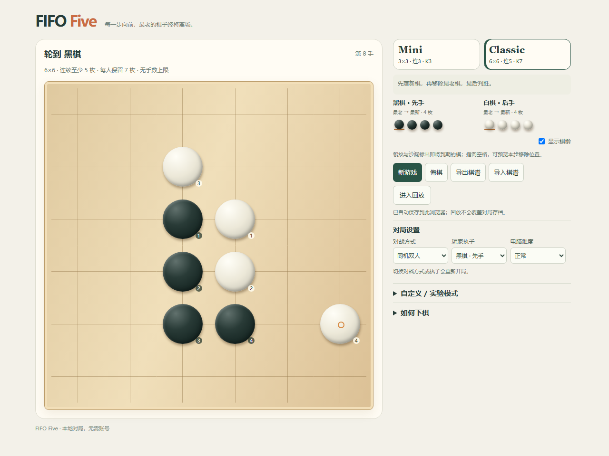
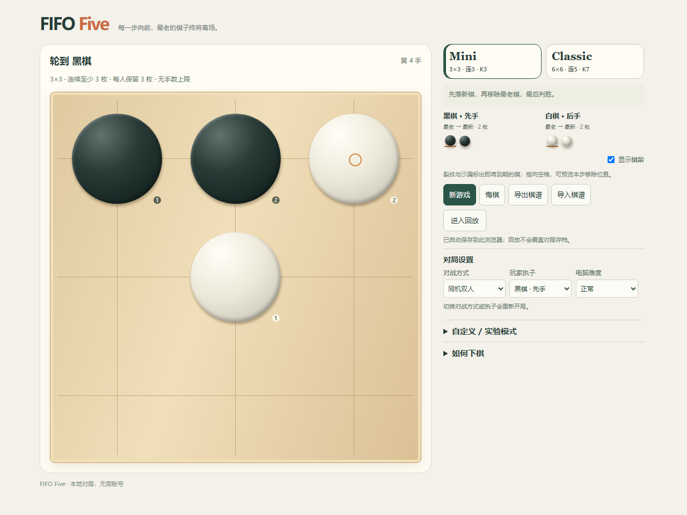
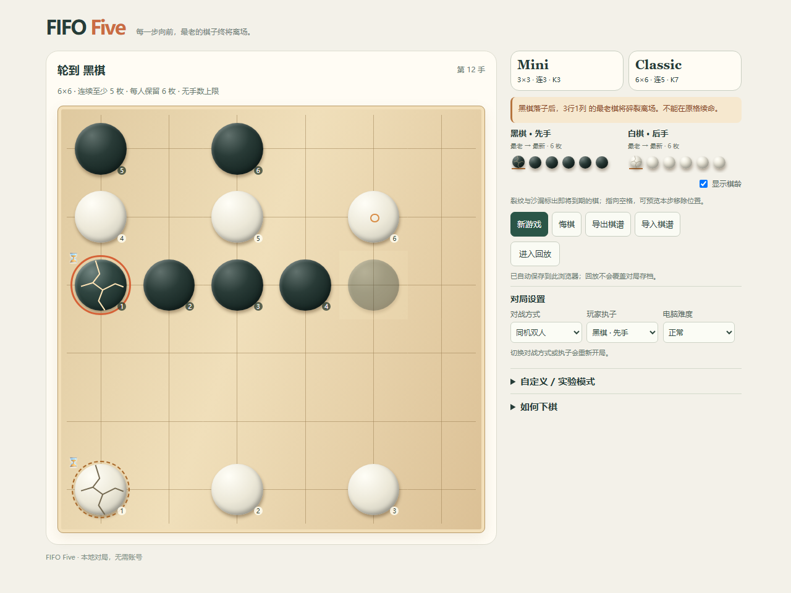

# FIFO Five / 时序连子棋

A connect-in-a-row game where stones have an age — and your oldest stone eventually disappears.

一种带有棋子寿命机制的连子棋。每名玩家只能保留有限数量的棋子，放入新棋后最老的棋子会消失，因此普通连子棋中的进攻、防守和威胁都会随着时间变化。

### Mini

**3×3 / 连3 / FIFO K=3**

快速、容易理解寿命机制。

### Classic

**6×6 / 连5 / FIFO K=7**

当前主要推荐模式，棋盘空间更大，可以进行更多阵型调整、进攻和防守。

其他棋盘大小、连线数量、FIFO 上限和永久棋模式都可以在“自定义 / 实验模式”中设置。为保持已有项目和棋谱兼容，引擎默认仍为 6×6 / 连5 / K6；点击推荐入口开始对应模式。







## 核心规则

1. 在当前为空的位置落新棋。
2. 如果超过本方棋子上限，删除本方最老棋。
3. 删除完成后，再判断横、竖或斜向连续连线胜负。
4. 不能直接在本回合即将消失的棋原位置续命。
5. 完整状态第三次重复判和；完整状态包含规则、行动方及双方有序棋龄队列。无合法落点也判和，可选规则手数上限独立配置。
6. 棋龄属于游戏状态的一部分。重复次数属于对局历史，恢复时从合法棋谱重新建立。

与普通五子棋不同，**同样的棋盘占位，由于棋龄不同，可能具有完全不同的战术结果**。

- **到期锁 / Expiry Lock**：关键防守棋即将到期，落新棋后失去阻挡，对手可能利用空格获胜。
- **到期伪威胁 / Expiring Threat**：表面能补齐的连线，因为本方关键老棋同时删除而失效。
- **棋龄改变强制杀结论**：有限搜索已验证若干合法样例；这不意味着整个游戏已求解或理论公平。

研究定义与真实数据见 [P3 报告](docs/P3_REPORT.md) 和 [战术样例](docs/P3_POSITIONS.md)。

## 本地运行

需要 Node.js 22.12+（推荐当前 LTS，附带 npm）。进入克隆后的项目目录运行：

```sh
npm ci
npm run dev
```

浏览器打开 http://127.0.0.1:5173 。Ctrl+C 停止开发服务器。

```sh
npm run build
npm exec vite preview -- --host 127.0.0.1
```

构建产物在 `dist/`，需要通过 HTTP(S) 服务访问，不要双击 HTML。玩已托管的网页不需要安装 Node；本仓库发布不包含网站部署，尚未启用 GitHub Pages。

## 操作

黑棋代表 X，白棋代表 O。点击当前空格落子；键盘方向键移动焦点，Enter 或空格确认。裂纹、沙漏和“最老 → 最新”队列展示寿命，指向空格可预览移除位置。碎裂和烟花支持系统“减少动态效果”，没有强制音效。

打开页面直接进入棋盘，有效存档自动恢复；轮到电脑时重新启动 Worker 搜索。存档只保存在当前浏览器与网站源中，不跨设备同步。回放不会覆盖对局存档，建议定期导出棋谱备份。悔棋会回到玩家上一次决策前。

## 已完成

- Mini / Classic 推荐模式、自定义规则、永久棋。
- 本地双人、人机 AI、后台 Worker 搜索与安全取消。
- FIFO 棋龄、寿命预览、碎裂消失效果与胜负结束反馈。
- 悔棋、自动存档、棋谱导入导出与回放。
- 有限强制杀研究、参数实验与战术挖掘。

## 当前限制

- 未完整强求解 Classic，尚不能证明规则理论公平。
- Firefox / Safari / 实体手机仍未完整验证。
- 没有在线联机、账号和服务器；游戏不调用外部 API。
- AI 没有使用模型训练。有限预算搜索和启发式分数不是数学证明或胜率。
- 自动存档没有跨标签页冲突合并；清除浏览器数据会删除存档。

## 验证

首次运行浏览器测试先安装 Chromium：

```sh
npm exec playwright install chromium
npm test
npm run test:e2e
npm run typecheck
npm run lint
npm run build
```

Playwright 自动启动本地开发服务器。实际检查记录见 [发布检查](docs/RELEASE_CHECK.md) 和 [项目进展](docs/PROGRESS.md)。

## 代码与研究

| 目录 | 内容 |
| --- | --- |
| `src/core/` | 配置、FIFO 转移、胜负、重复历史和棋谱 |
| `src/ai/`、`src/workers/` | 统一 AI 接口与后台搜索 |
| `src/ui.tsx`、`src/style.css` | 网页表现与交互 |
| `src/research/` | 有限强制胜、FIFO 战术与对称性 |
| `tests/`、`fixtures/` | 单元、浏览器测试和规则样例 |
| `experiments/`、`positions/` | 可复现实验、完整棋谱和战术库 |

棋谱格式是 `{schemaVersion:1,rules,moves,metadata?}`，落点为 `row * boardSize + column`。导入通过原引擎逐手校验，不信任棋盘快照。

AI 简单档使用精确短期战术，正常/困难使用 Alpha-Beta；节点预算不含必须完成的战术预处理，Worker 可直接取消。P3 使用 128/960 节点研究预算，不能直接外推网页 8000/60000 档位。cutoff 是实验截止，不能计作规则和棋；重复确定性轨迹不作为额外独立样本。

复现方法见 [研究工具](docs/RESEARCH.md)，历史证据见 [P2 报告](docs/P2_REPORT.md)、[P3 报告](docs/P3_REPORT.md)。保留原始 JSON 和验证记录，没有把小样本观察写成平衡性证明。

## License

当前未设置开源许可证。源码公开不等于已授予复制、修改和分发许可；许可证将由项目所有者之后决定。
