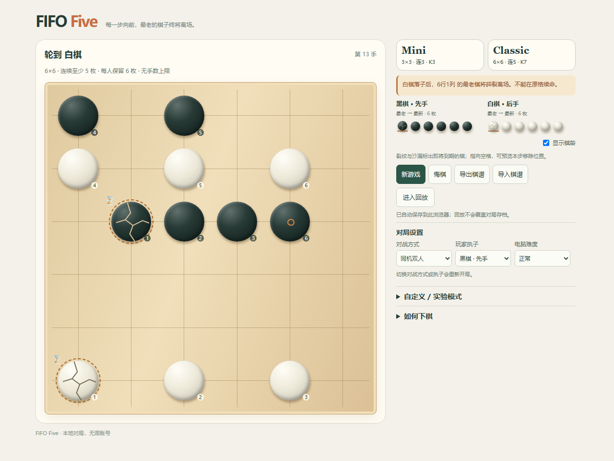

# 展示图片

这些截图直接来自本地 Chromium 中的实际游戏页面，没有浏览器地址栏、开发工具或个人信息。截图没有改变游戏逻辑。

- [Classic](classic.png)：6×6 / 连5 / K7，合法开局。
- [Mini](mini.png)：3×3 / 连3 / K3，合法开局。
- [到期前](expiry.png) 与 [删除后](expiry-after.png)：使用 fixtures/rule-cases.json 的 false-five-after-expiry 前缀，在 3行5列落子后，3行1列最老棋被删除。表面五连没有保留下来。该示例为兼容默认 K6，不冒充 Classic K7。

| 落子前的到期预览 | 落子并删除后 |
| --- | --- |
|  |  |
